# MadCamp_week4_Client
client program with andriod, server repository [here](https://github.com/Johyebin/MadCamp_week4_Server)

## 카페인 섭취량 기록  
- 개발에 몰두하다보면 커피를 자주 소비하곤 합니다. 과도한 카페인 섭취는 건강에 해롭고 음료 가격 역시 만만치 않다고 느껴져 커피 소비를 줄이고자 해당 어플리케이션을 제작하였습니다.  

- 당일 섭취한 음료를 기록하면 카페인 섭취량 및 소비 금액을 합산하여 보여줍니다. 권장량을 초과할 경우 경고창이 표출되며 카페인 섭취량이 붉은색으로 표시됩니다. 

- 최애 카페 및 최애 음료를 설정할 수 있고 기록을 잊지 않도록 알람을 설정할 수 있습니다.  

- 실제 카페와의 연동을 가정하여 서버를 구축하였습니다. 서버를 통해 결제 내역이 쌓이고, 앱 실행시 이를 우선적으로 표시하여 그중 본인이 섭취한 항목을 선택하도록 하였습니다.  

## 실행화면
#### 로딩 및 메인

  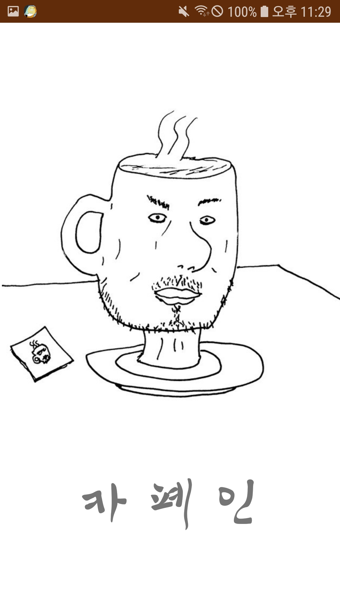
  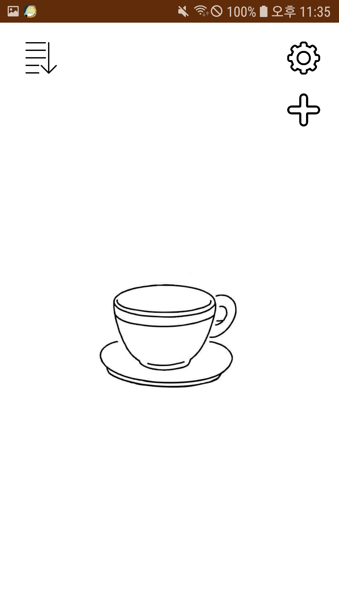 
  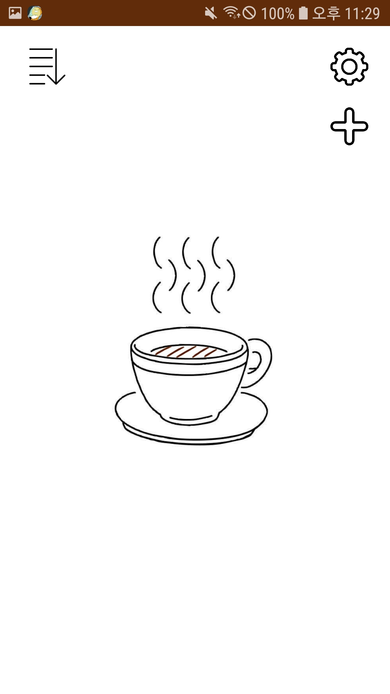 
  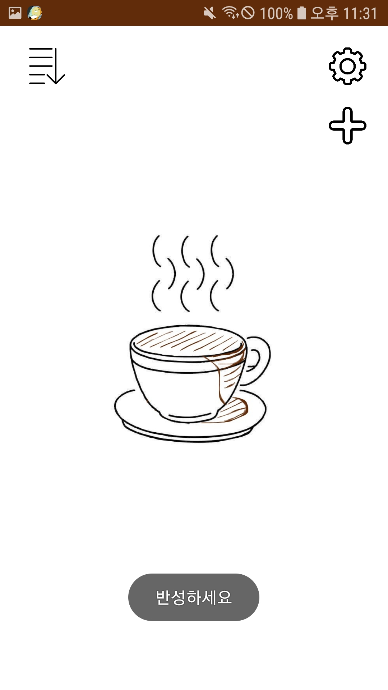 

당일 카페인 섭취량에 따라 메인 화면의 커피잔 상태가 변화합니다.  

#### 설정  

  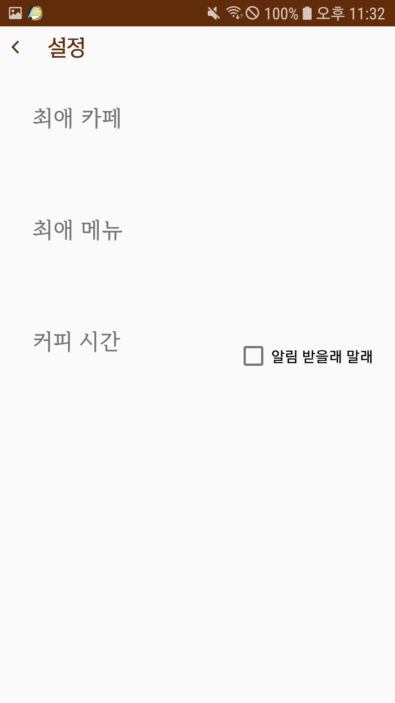
  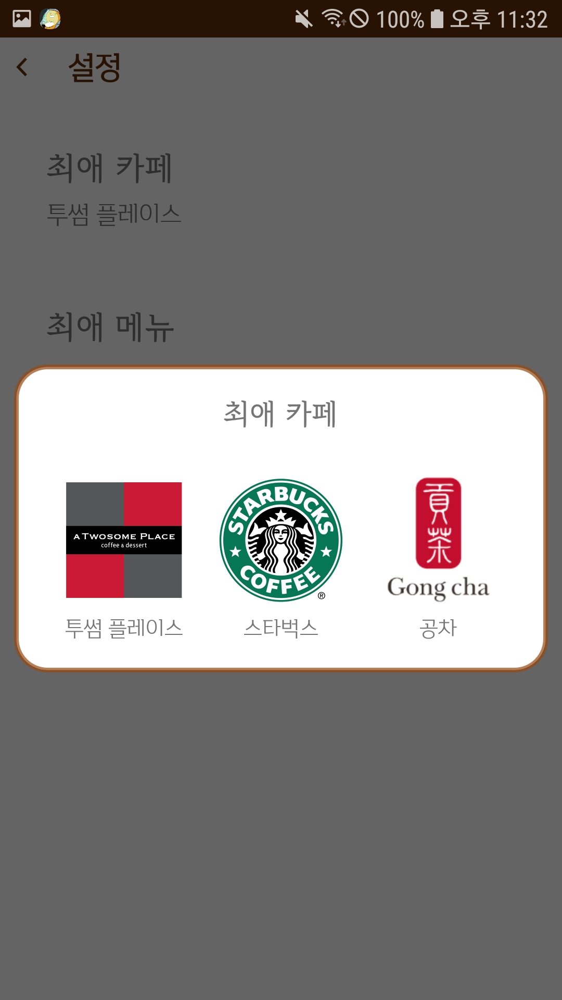 
  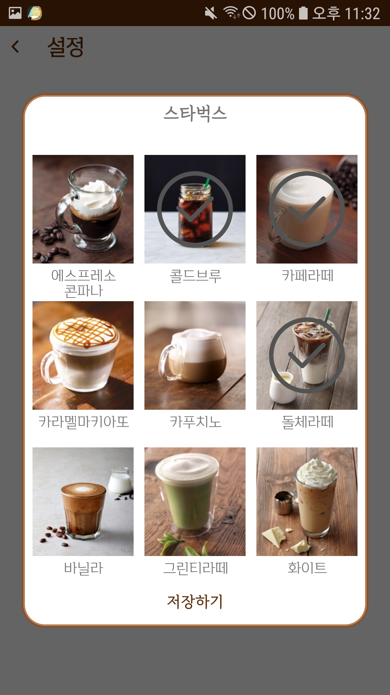 
  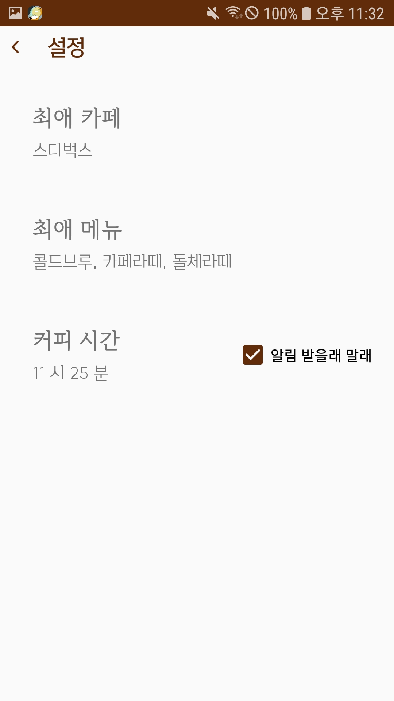 

최애 카페를 우선 설정하고 해당 카페의 음료 중 최애 메뉴를 설정할 수 있습니다.  

#### 오늘의 커피  

  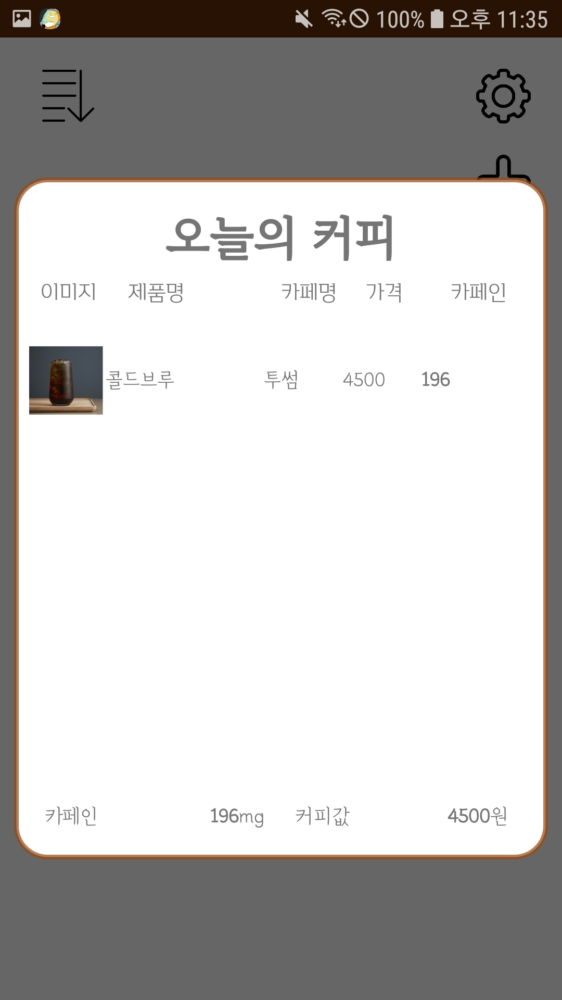
  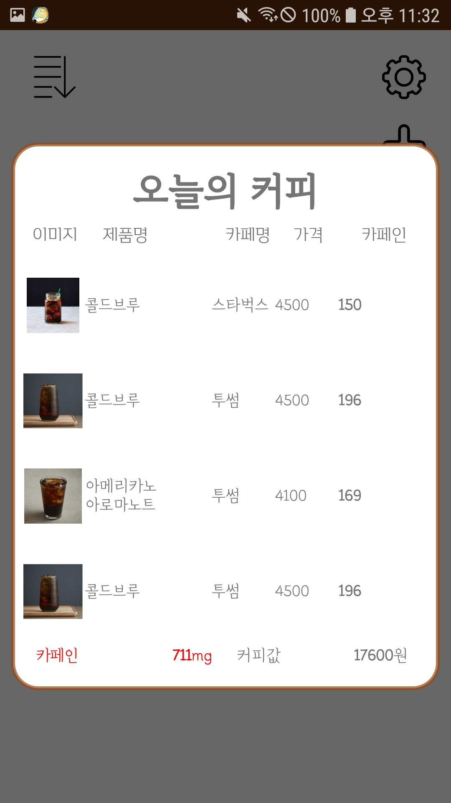 
  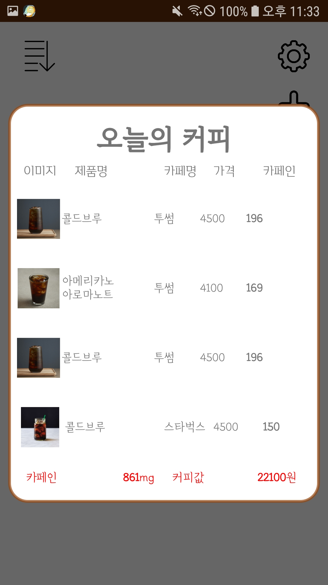 
  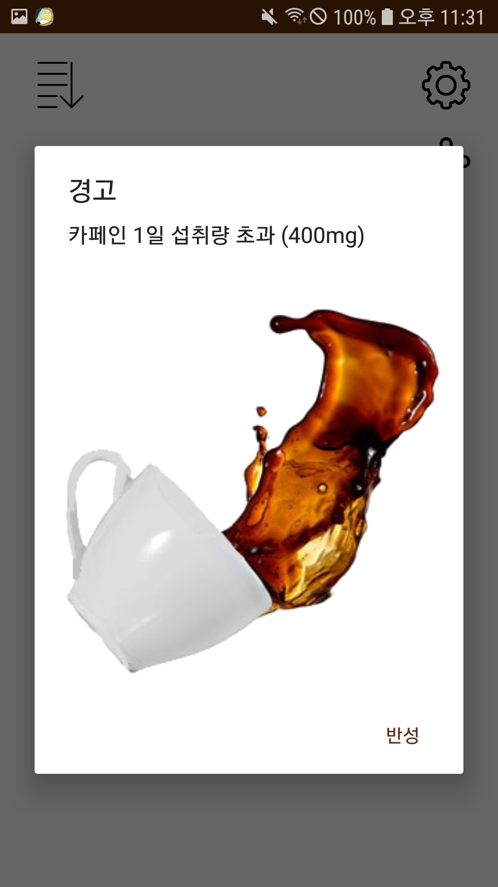 

메인 화면의 커피잔을 클릭하면 오늘의 커피 화면이 표출됩니다. 하단에 카페인 섭취량 및 커피값을 합산해서 보여주고 카페인은 400mg, 커피값은 20,000원을 초과할 경우 붉은색으로 표시됩니다. 섭취량 초과시에는 경고 팝업창이 한 차례 표출됩니다. 

#### 커피 추가  

  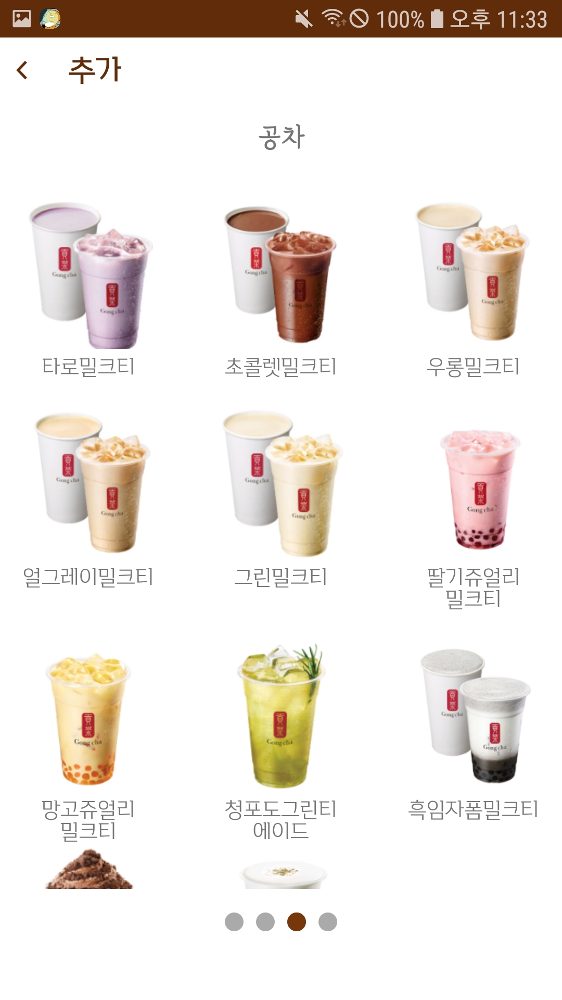
  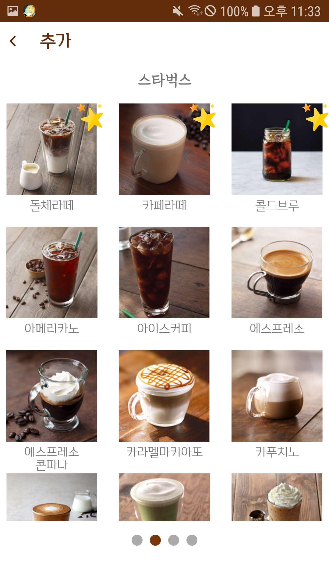 
  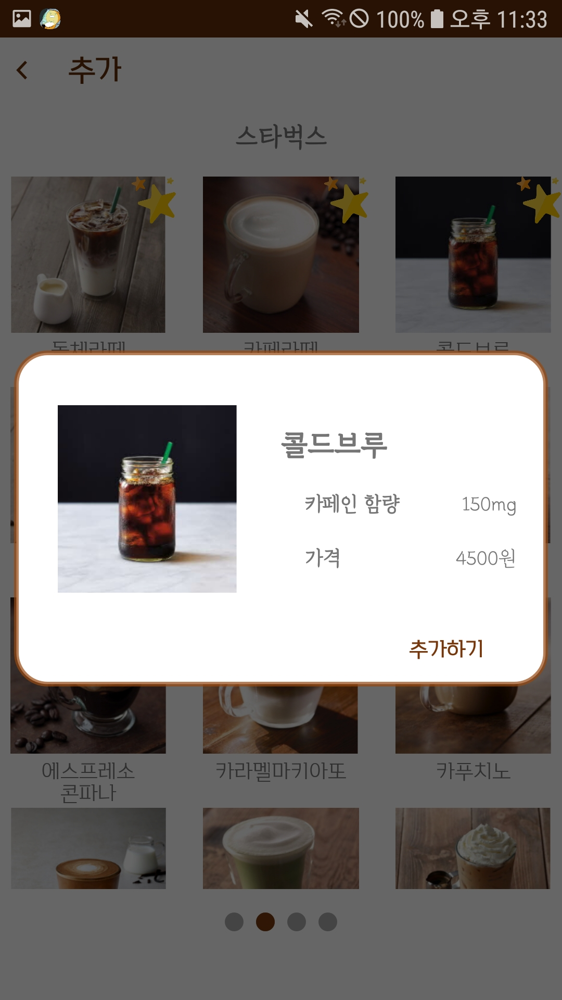 

메인의 + 버튼을 클릭하여 커피를 추가할 수 있습니다. 이때 최애 카페가 설정되어 있다면 최애 카페의 메뉴 목록을 우선 표출합니다. 또 최애 메뉴가 설정되어있다면 해당 메뉴들을 최상단에 배치합니다.  

#### 일괄 결제  

  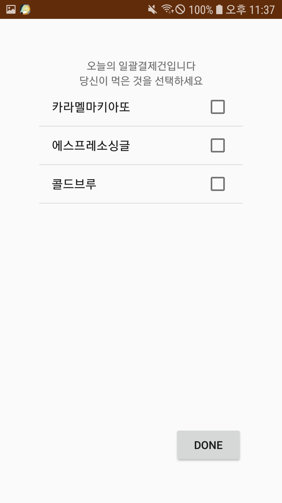
  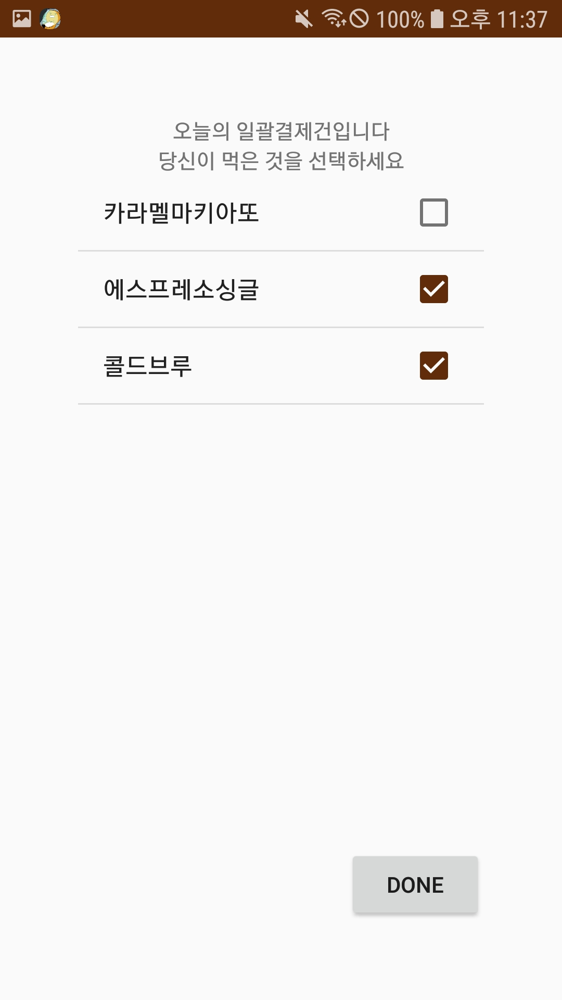 
  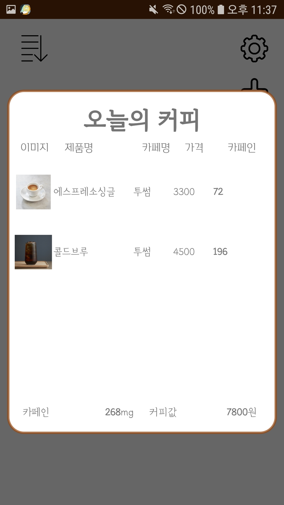 

서버에 결제 내역이 쌓여있을 경우, 앱 실행시 우선 표시됩니다. 동료에게 커피를 사는 경우 등을 고려하여 본인이 섭취한 메뉴가 무엇인지 선택할 수 있도록 화면을 구성하였습니다.